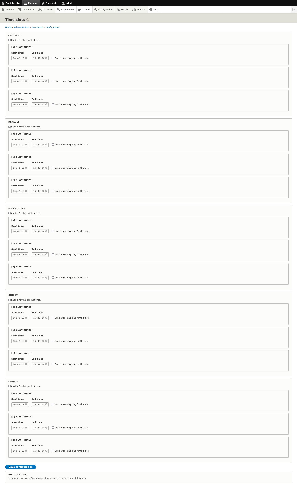
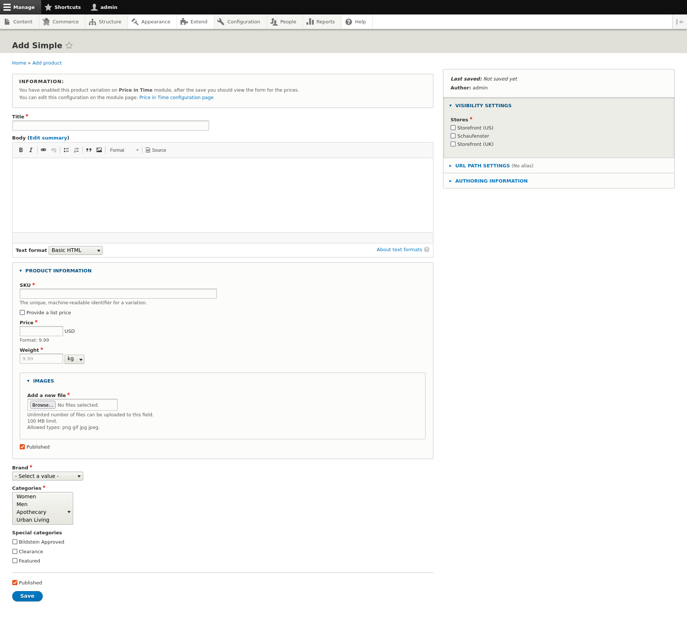
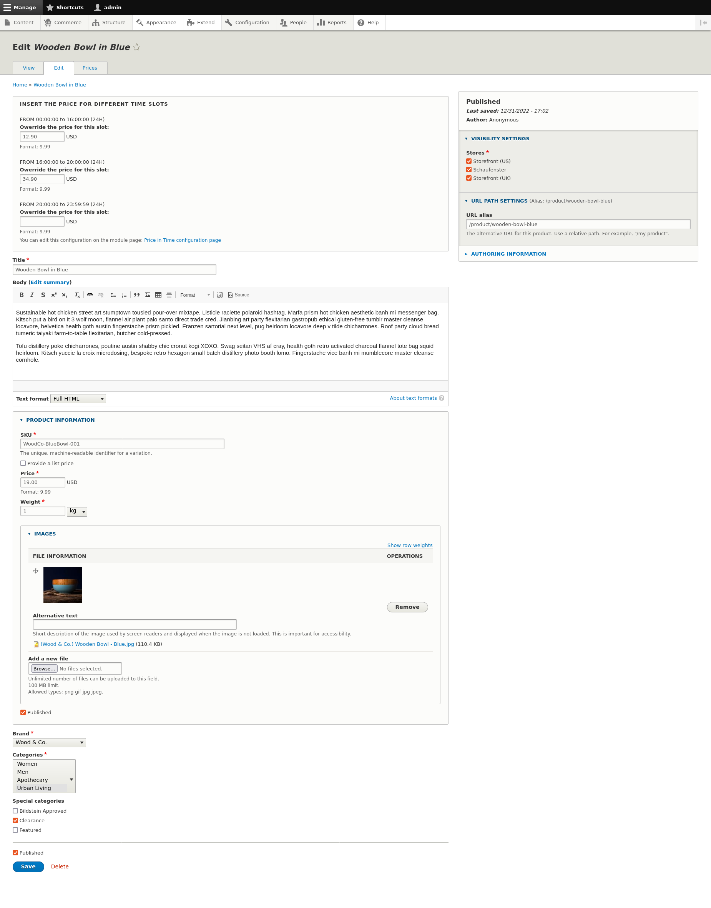
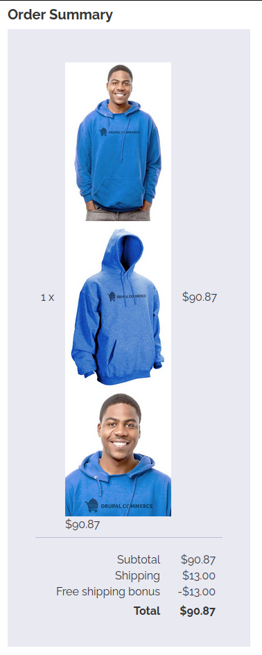

# Price in Time: the module
## Description
Custom module for Drupal Commerce projects. With this module, you can enable time slot for specific product variation and manages times and price for these. You can also set free shipping for a time slot and product variation.

## How to use this module
First of all, enable it as usual and go to the configuration page on: _/admin/commerce/config/time-slots_; on this page, you can see all the product variations listed.

### Set the configuration
To enable the module, you should check on the options: **Enable for this product type.** and set the start and end times of every single slot. For example, a configuration can be the following: 

`Start time: 00:00:00 - End time: 16:00:00`

`Start time: 16:00:00 - End time: 20:00:00`

`Start time: 20:00:00 - End time: 23:59:59`

For the single slot, we can specify the free shipping option, so on the checkout process, all the shipping costs will be canceled by a bonus (with the same price value).

**Note:** there is a check for overlapped times, be sure that there are no overlapped times.

**Tips:** after the submission, you should rebuild the cache to make sure that all configurations will be applied.

### On the product page
The form with all slots will appear only after the first node/product saving. Initially, you will see this message on the node creation page:

Instead, on the editing page of an existing product/variation, you will see the form with the time slots and relative prices (if they are set). If the price is not set for a slot, will be used the default price of the product/variation.

### On the variation page
The same thing is for the variation page. The product can have multiple variations (think of a t-shirt, it can be small and blue, large and red, and so on); different prices for the different slots can be set also on the single variation type.

### Where I can see the "free shipping bonus"
This is an example of an order where we previously set the free shipping on the time slot:

As you can see, the bonus worth the same as the shipping costs (and this is true for every shipping method with different prices).